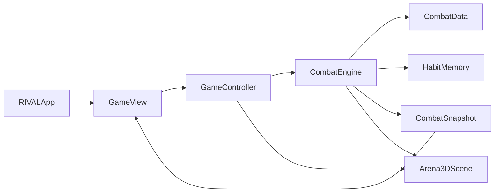

# RIVAL

플레이어의 반복 습관을 기억하고 라운드가 진행될수록 대응 방식을 바꾸는 **iPhone 가로형 3D 복싱 게임**입니다. 현재 저장소의 메인 제품은 Swift 6, SwiftUI, SceneKit으로 구현한 네이티브 iOS 앱입니다. Python·웹·C++ 버전은 RIVAL로 발전하기까지의 규칙 검증과 이식 과정을 보여주는 이전 구현으로 함께 보존합니다.

## 앱 확인

| 항목 | 링크 및 상태 |
| --- | --- |
| TestFlight 외부 테스트 | [RIVAL Public Test](https://testflight.apple.com/join/btSgA8uT) · 2026-08-10 기준 Apple 베타 앱 심사 대기 중 |
| 플레이 영상 | [YouTube에서 보기](https://youtu.be/01h8Lo5UIJc?si=z4azF3XPkZuc9WOX) |
| 게임 소개·플레이 설명 | [PDF](ios-pixel-boxing/RIVAL_GAME_GUIDE.pdf) · [Markdown 원본](ios-pixel-boxing/GAME_GUIDE.md) |
| AI 활용 기술 설명 | [PDF](ios-pixel-boxing/RIVAL_AI_USAGE.pdf) · [Markdown 원본](ios-pixel-boxing/AI_USAGE.md) |
| 게임 의도·고도화 기준 | [RIVAL 게임 의도와 설계 철학](docs/RIVAL_GAME_INTENT_AND_DESIGN_PHILOSOPHY.md) |
| iOS 빌드·배포 안내 | [ios-pixel-boxing/README.md](ios-pixel-boxing/README.md) |

TestFlight 빌드는 `RIVAL 1.0 (1)`이며 iOS 17 이상 iPhone에서 가로 화면으로 실행됩니다. 외부 테스트는 Apple의 베타 앱 심사가 승인된 뒤 공개 링크를 통해 참여할 수 있습니다.

## 게임 핵심

RIVAL은 단순히 체력과 공격력이 커지는 상대가 아닙니다. 플레이어가 자주 사용하는 공격, 가드, 좌우 더킹, 전후 이동과 거리 습관을 경기 중 기록하고, 그 비율과 현재 라운드를 함께 사용해 다음 행동의 선택 가중치를 조정합니다.

- 잽, 크로스, 좌우 바디, 좌우 훅, 좌우 어퍼컷으로 구성된 8종 공격
- 상대 공격 손에 맞춰 방향을 선택하는 좌우 더킹
- 가드 파괴, 백스텝, 헛스윙 노출, 카운터 보너스와 반복 기술 약화
- 플레이어 승리 때만 올라가는 45초 라운드와 단계별 AI 적응도
- 앱을 종료해도 `UserDefaults`에 유지되는 플레이 습관 메모리
- SceneKit 노드와 관절로 생성한 3D 링, 복서, 조명, 카메라와 KO 모션
- SwiftUI 기반 가로형 터치 HUD, VoiceOver 레이블과 피해량 비례 햅틱

현재 AI는 훈련된 외부 머신러닝 모델이나 네트워크 API를 실행하지 않습니다. 기기 안에서 행동 빈도를 누적하고 규칙 기반 가중치를 갱신하므로 오프라인으로 동작하며, 플레이 데이터는 외부 서버로 전송되지 않습니다.

## 조작

화면 왼쪽의 이동·방어 버튼과 오른쪽의 `JAB`, `CROSS`를 함께 사용합니다.

| 홀드 입력 | JAB | CROSS |
| --- | --- | --- |
| 없음 | 잽 | 크로스 |
| 중앙 가드 | 왼쪽 어퍼컷 | 오른쪽 어퍼컷 |
| L 더킹 | 왼쪽 바디 | 오른쪽 훅 |
| R 더킹 | 왼쪽 훅 | 오른쪽 바디 |

`BACKSTEP`은 스태미나를 소비해 상대 반대 방향으로 빠르게 이동하며 짧은 무적 시간을 부여합니다. 자세한 피해량, 사거리, 가드 비용과 라운드 판정은 [게임 설명서](ios-pixel-boxing/GAME_GUIDE.md)에서 확인할 수 있습니다.

## 소스 코드 지도

메인 앱 소스는 모두 [`ios-pixel-boxing`](ios-pixel-boxing/)에 있습니다. 특정 기능을 확인하거나 수정하려면 아래 파일부터 보면 됩니다.

| 확인할 기능 | 소스 파일 | 주요 내용 |
| --- | --- | --- |
| 앱 시작점과 생명주기 | [PixelBoxingApp.swift](ios-pixel-boxing/PixelBoxingIOS/PixelBoxingApp.swift) | `RIVALApp`, `AppDelegate`, 가로 방향 고정과 최초 화면 생성 |
| 전투 수치와 8종 공격 | [CombatCore.swift](ios-pixel-boxing/PixelBoxingIOS/CombatCore.swift) | `Punch`, `AttackSpec`, `CombatData`에 피해량·사거리·스태미나 비용·더킹 방향 정의 |
| 라운드와 적중 판정 | [CombatCore.swift](ios-pixel-boxing/PixelBoxingIOS/CombatCore.swift) | `FighterModel`, `CombatEngine`이 이동, 공격, 가드, 노출, 카운터, KO와 라운드 처리 |
| 플레이 습관 학습 | [CombatCore.swift](ios-pixel-boxing/PixelBoxingIOS/CombatCore.swift) | `HabitMemory`, `HabitSnapshot`이 행동 기록·저장·비율 계산·RIVAL 선택 가중치 생성 |
| 화면용 게임 상태 | [CombatCore.swift](ios-pixel-boxing/PixelBoxingIOS/CombatCore.swift) | `CombatSnapshot`, `CombatCommentary`가 HUD 수치와 경기 해설 제공 |
| 입력·전투·햅틱 연결 | [GameController.swift](ios-pixel-boxing/PixelBoxingIOS/GameController.swift) | `GameController`가 터치 홀드, 조합 공격, 백스텝, 학습 초기화와 햅틱을 엔진에 연결 |
| 3D 링과 복서 | [Arena3DScene.swift](ios-pixel-boxing/PixelBoxingIOS/Arena3DScene.swift) | `Arena3DScene`, `BoxerRig`이 링·로프·객석·관절형 복서·공격·피격·KO 자세 생성 |
| 카메라와 렌더링 | [Arena3DScene.swift](ios-pixel-boxing/PixelBoxingIOS/Arena3DScene.swift) | 어깨너머 카메라, 거리 기반 줌, 회전 제한, 프레임 업데이트와 SwiftUI 브리지 |
| 터치 HUD와 팝업 | [GameView.swift](ios-pixel-boxing/PixelBoxingIOS/GameView.swift) | HP·스태미나·라운드 HUD, 조작 버튼, 시작 안내, 일시정지와 학습 초기화 UI |
| 앱 리소스와 메타데이터 | [Assets.xcassets](ios-pixel-boxing/PixelBoxingIOS/Assets.xcassets/) · [Info.plist](ios-pixel-boxing/PixelBoxingIOS/Info.plist) | 앱 아이콘·색상과 표시 이름·가로 방향·전체 화면 설정 |
| Xcode 프로젝트 원본 | [project.yml](ios-pixel-boxing/project.yml) | 앱·테스트 타깃, Bundle ID, Team, iOS 17, Swift 6와 버전 정의 |
| 단위 회귀 테스트 | [PlaceholderTests.swift](ios-pixel-boxing/PixelBoxingIOSTests/PlaceholderTests.swift) | 공격 수치, 조합, 더킹, 카운터, AI 적응, 롤백, 카메라 등 30개 테스트 |
| 가로 UI 테스트 | [PixelBoxingIOSUITests.swift](ios-pixel-boxing/PixelBoxingIOSUITests/PixelBoxingIOSUITests.swift) | 가로 회전, 안내 화면, 조작 버튼 터치 범위와 학습 초기화 검사 |
| TestFlight 내보내기 | [ExportOptions.plist](ios-pixel-boxing/ExportOptions.plist) · [TestFlightUploadOptions.plist](ios-pixel-boxing/TestFlightUploadOptions.plist) | App Store Connect 배포와 업로드 옵션 |
| 앱 아이콘 생성 | [generate_app_icon.swift](ios-pixel-boxing/scripts/generate_app_icon.swift) | 외부 이미지 없이 앱 아이콘을 생성하는 Swift 스크립트 |

`RIVAL.xcodeproj`는 XcodeGen으로 만들어지는 생성물입니다. 타깃, 서명, 버전 또는 빌드 설정은 생성된 프로젝트를 직접 고치지 말고 [`project.yml`](ios-pixel-boxing/project.yml)을 수정한 뒤 프로젝트를 다시 생성해야 합니다.

## 앱 구조



1. `RIVALApp`이 SwiftUI 루트인 `GameView`를 생성합니다.
2. `GameView`의 버튼 입력은 `GameController`를 통해 `CombatEngine`으로 전달됩니다.
3. `CombatEngine`은 `CombatData`의 공격 규칙과 `HabitMemory`의 플레이 습관을 사용해 전투와 RIVAL 행동을 결정합니다.
4. 결과는 `CombatSnapshot`으로 HUD에 전달되고, 같은 엔진 상태를 `Arena3DScene`이 3D 자세와 카메라에 반영합니다.
5. 입력, 규칙, 화면 상태와 3D 표현을 분리해 전투 판정을 SceneKit 애니메이션과 독립적으로 테스트할 수 있습니다.

## 빌드와 테스트

XcodeGen이 필요합니다. 저장소는 생성된 Xcode 프로젝트와 빌드 결과물을 Git으로 관리하지 않으며, [`project.yml`](ios-pixel-boxing/project.yml)을 기준으로 항상 재생성합니다.

```bash
cd ios-pixel-boxing
xcodegen generate
xcodebuild \
  -project RIVAL.xcodeproj \
  -scheme RIVAL \
  -sdk iphoneos \
  -destination 'generic/platform=iOS' \
  CODE_SIGNING_ALLOWED=NO \
  build-for-testing
```

위 명령은 시뮬레이터를 실행하지 않고 generic iOS 실기기 대상으로 앱과 테스트 타깃의 컴파일을 검증합니다. 실제 iPhone 실행과 TestFlight Archive에는 [`project.yml`](ios-pixel-boxing/project.yml)에 설정된 Apple Developer Team의 유효한 서명이 필요합니다.

## 개발 과정

이 프로젝트는 표현 방식을 먼저 정한 것이 아니라, 각 버전에서 확인한 한계를 다음 구현의 질문으로 바꾸며 발전했습니다.

| 단계 | 구현 | 확인한 내용 |
| --- | --- | --- |
| 1 | C++20 터미널 TUI | 실시간 전투, 라운드, HP·스태미나, 저장과 플레이 패턴 기록 |
| 2 | 브라우저·Tkinter 횡 액션 | 공격·회피 입력, 타격 모션과 화면 피드백 |
| 3 | Python Pixel Boxing Top-Down | 링 안 360도 이동, 의사 3D 카메라, 방향 더킹과 8종 공격 규칙 |
| 4 | Swift RIVAL iOS | 네이티브 터치 입력, SceneKit 3D 복서, 온디바이스 적응형 AI와 TestFlight 배포 |

핵심 판단 기준은 버튼 연타보다 거리·방향·타이밍이 이기게 만드는 것입니다. 헛스윙 노출, 카운터, 반복 기술 약화, 스태미나와 탈진을 연결했고, RIVAL은 플레이어의 반복 선택을 점차 공략하도록 설계했습니다.

## 저장소 구성

| 경로 | 역할 |
| --- | --- |
| [`ios-pixel-boxing`](ios-pixel-boxing/) | 현재 메인 RIVAL iPhone 앱, Swift 전투 엔진, SceneKit 3D 화면, 테스트와 제출 문서 |
| [`desktop-pixel-boxing`](desktop-pixel-boxing/) | iOS 이식 기준이 된 Python/Tkinter 탑다운 구현과 이전 횡 액션 프로토타입 |
| [`pixel-boxing`](pixel-boxing/) | 설치 없이 확인할 수 있는 [GitHub Pages 웹 이식판](https://acertainromance401.github.io/GAME/) |
| [`include`](include/) · [`src`](src/) | 아이디어를 처음 검증한 C++20 터미널 TUI와 학습 AI |
| [`tests`](tests/) | Python 전투 코어와 UI 동작을 검증하는 레거시 회귀 테스트 |
| [`docs`](docs/) | 프로젝트 구조와 기존 설계 자료 |

현재 제품 기능은 iOS 소스를 기준으로 확인하고, 이전 버전은 규칙의 기원과 구현 변화를 비교할 때 사용합니다.

## 라이선스

이 저장소의 소스 코드는 [MIT License](LICENSE)로 공개되어 있습니다.
