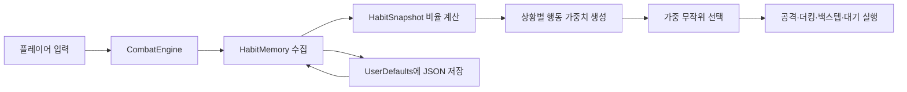

# RIVAL AI 활용 기술 문서

| 항목 | 내용 |
| --- | --- |
| 대상 앱 | RIVAL 1.0 (빌드 1) |
| 플랫폼 | iPhone · iOS 17 이상 |
| 게임 내 AI 방식 | 규칙·통계·가중 확률 기반 적응형 의사결정 |
| 생성형 AI 사용 | GitHub Copilot을 개발 보조로 사용 |
| 외부 AI API | 사용하지 않음 |
| 플레이 데이터 전송 | 없음 · 기기 내부 저장 |
| 문서 기준일 | 2026년 8월 10일 |

## 문서 범위

RIVAL에는 서로 목적이 다른 두 종류의 AI 활용이 있습니다.

| 구분 | 역할 | 실행 시점 |
| --- | --- | --- |
| 게임 내 적응형 AI | 플레이어의 습관을 통계화하고 RIVAL의 다음 행동 확률을 조정 | 앱 실행 중, iPhone 내부 |
| 생성형 AI 개발 보조 | 요구사항 정리, Swift 코드·테스트·문서 초안 작성과 오류 분석 보조 | 개발 과정에서만 사용 |

게임 앱에는 생성형 AI 모델이나 대화 기능이 포함되지 않습니다. 게임 내 RIVAL도 LLM이나 외부 AI API가 아니라 Swift로 직접 구현한 규칙·통계 기반 의사결정 시스템입니다.

### 핵심 구분

- **게임 내 적응형 AI:** 앱에 포함된 실제 런타임 기능입니다. 플레이어의 반복 습관을 숫자로 집계하고 RIVAL의 다음 행동 확률을 변경합니다.
- **생성형 AI 개발 보조:** 개발자가 코드를 만들고 검토하는 과정에서 사용한 도구입니다. 완성된 앱 안에는 포함되지 않으며 플레이 중 호출되지 않습니다.
- **강화학습 여부:** 현재 iOS 빌드는 신경망을 학습하거나 보상으로 정책을 갱신하는 강화학습 모델이 아닙니다. 행동 규칙과 가중치가 소스 코드에 명시된 설명 가능한 적응형 시스템입니다.

이 구분은 “AI를 사용했다”는 표현이 앱 내부 모델 실행과 개발 도구 사용을 혼동하지 않도록 하기 위한 것입니다.

## 게임 내 적응형 AI 구조

### 전체 흐름



핵심 구현은 `PixelBoxingIOS/CombatCore.swift`의 `HabitMemory`, `HabitSnapshot`, `CombatEngine`에 있습니다.

### 구현 구성요소

| 구성요소 | 책임 | 입력 | 출력 |
| --- | --- | --- | --- |
| `CombatEngine` | 전투 상태 갱신과 RIVAL의 판단 주기 관리 | 프레임 경과시간, 플레이어 입력, 전투 상태 | 이동, 공격, 회피, 라운드 결과 |
| `HabitMemory` | 플레이 습관 누적과 직렬화 | 공격 시작, 가드·더킹·이동 상태 | 누적 횟수와 시간 표본 |
| `HabitSnapshot` | 누적값을 비율과 적응도로 변환 | `HabitMemory` | 습관 비율, 표본 강도, 행동 가중치 |
| `AttackSpec` | 8종 공격의 고정 전투 규칙 | 공격 종류 | 시간, 피해, 사거리, 각도, 비용, 목표 부위 |
| `weightedChoice` | 가중치에 따른 행동 선택 | 행동별 0 이상의 가중치 | 하나의 행동 문자열 |
| `UserDefaults` | 세션 간 습관 보존 | `Codable` JSON 데이터 | 다음 앱 실행 시 복원할 메모리 |

화면 표현은 `Arena3DScene.swift`, 사용자 입력은 `GameView.swift`, 전투 엔진과 화면 연결은 `GameController.swift`가 담당합니다. AI의 판단 규칙 자체는 3D 렌더링과 분리되어 `CombatCore.swift`에서 계산됩니다.

### 1. 플레이 습관 수집

`HabitMemory`는 다음 데이터를 누적합니다.

- 8종 공격별 사용 횟수와 가장 자주 사용한 공격
- 같은 공격을 연속으로 사용한 횟수
- 가드 유지 비율
- 왼쪽·오른쪽 더킹 비율
- 백스텝 비율
- 전진 압박과 후퇴 비율
- 현재까지 확보된 표본의 강도

공격은 버튼 입력이 실제 공격으로 시작됐을 때 기록합니다. 가드·더킹·이동은 매 프레임의 경과시간을 기준으로 표본화하므로 프레임 속도 차이가 습관 비율을 크게 바꾸지 않도록 했습니다.

#### 누적 데이터와 파생 데이터

| 누적 데이터 | 파생 데이터 | 의미 |
| --- | --- | --- |
| 공격별 사용 횟수 | 잽 비율, 바디 공격 비율, 선호 공격 | 플레이어가 반복하는 공격군 |
| 최근 공격과 연속 횟수 | `repeatStreak` | 같은 기술을 몇 번 연속 사용했는지 |
| 가드 표본 | `guardRatio` | 전체 관찰 중 가드를 유지한 비율 |
| 좌·우 더킹 표본 | `duckLeftRatio`, `duckRightRatio` | 한쪽 회피를 반복하는 경향 |
| 백스텝 표본 | `backstepRatio` | 무적 후퇴를 사용하는 경향 |
| 전진·후퇴 표본 | `pressureRatio`, `retreatRatio` | 압박형인지 거리 유지형인지 |
| 전체 표본량 | `sampleStrength` | 현재 관찰을 얼마나 강하게 반영할지 결정하는 값 |

공격 횟수는 실제 공격 시작에 성공했을 때만 증가합니다. 스태미나 부족이나 경직 때문에 시작되지 않은 버튼 입력은 습관으로 기록하지 않습니다. 연속 상태는 `deltaTime × 8`로 정규화한 표본을 누적하고, `sampleStrength = min(1, totalSamples / 18)`로 0과 1 사이의 신뢰도로 변환합니다.

### 2. 적응도 계산

RIVAL의 적응도는 라운드 진행도와 수집된 표본량을 함께 사용합니다.

```text
adaptation = clamp(0.18 + 0.16 × (round - 1) + 0.58 × sampleStrength, 0.18, 1.0)
```

- 첫 라운드에는 최소 적응도만 적용해 상대가 처음부터 지나치게 강해지지 않습니다.
- 라운드가 올라가고 표본이 쌓일수록 적응도가 최대 `1.0`에 가까워집니다.
- 적응도가 높아지면 습관 대응 가중치가 커지고 행동 결정 간격도 짧아집니다.

예를 들어 표본 강도가 0인 ROUND 1의 적응도는 0.18입니다. 같은 표본량이라도 라운드가 높아지면 라운드 항 `0.16 × (round - 1)`이 더해집니다. 최종값은 항상 0.18에서 1.0 사이로 제한되므로 계산값이 무한히 증가하지 않습니다.

### 3. 행동 가중치 생성

RIVAL의 선택 후보는 8종 공격, 왼쪽·오른쪽 더킹, 백스텝, 대기입니다. 각 후보의 가중치는 현재 거리와 플레이 습관에 따라 조정됩니다.

| 관찰된 상황 | 가중치 변화 예시 |
| --- | --- |
| 원거리 | 긴 잽과 크로스 선호 증가 |
| 근거리 | 바디샷·훅·어퍼컷 선호 증가 |
| 가드를 자주 사용 | 가드를 공략하는 바디샷 증가 |
| 한쪽 더킹 반복 | 해당 방향을 노리는 펀치 증가 |
| 잽 반복 | 크로스·오른쪽 훅·오른쪽 더킹 증가 |
| 바디 공격 반복 | 어퍼컷 증가 |
| 지속적인 전진 압박 | 백스텝과 훅 증가 |
| 잦은 후퇴·백스텝 | 잽·크로스로 추격할 확률 증가 |
| 같은 공격 3회 이상 반복 | 좌우 더킹 확률 증가 |
| 플레이어가 노출 상태 | 강한 카운터 공격 확률 증가, 대기 확률 감소 |

생성된 가중치의 합 안에서 무작위 값을 하나 뽑아 행동을 선택합니다. 따라서 같은 상황에서도 항상 똑같이 반응하지 않지만, 반복 습관이 뚜렷할수록 대응 행동이 더 자주 등장합니다.

#### 주요 임계값

| 조건 | 임계값 | 추가되는 대표 대응 |
| --- | ---: | --- |
| 가드 비율 | 0.22 초과 | 왼쪽·오른쪽 바디샷 증가 |
| 오른쪽 더킹 비율 | 0.16 초과 | 크로스·오른쪽 훅·오른쪽 어퍼컷 증가 |
| 왼쪽 더킹 비율 | 0.16 초과 | 잽·왼쪽 훅·왼쪽 어퍼컷 증가 |
| 잽 비율 | 0.34 초과 또는 최다 공격이 잽 | 크로스·오른쪽 훅·오른쪽 더킹 증가 |
| 바디 공격 비율 | 0.30 초과 | 좌·우 어퍼컷 증가 |
| 전진 압박 비율 | 0.20 초과 | 백스텝·좌우 훅 증가 |
| 백스텝 비율 | 0.14 초과 | 잽·크로스 추격 증가 |
| 후퇴 비율 | 0.18 초과 | 잽·크로스 추격 증가 |
| 같은 공격 반복 | 3회 이상 | 좌·우 더킹 증가 |
| 플레이어 노출 | 노출 시간 0 초과 | 크로스·오른쪽 어퍼컷·오른쪽 훅 증가 |

#### 선택 절차 의사코드

```text
snapshot = habits.snapshot
adaptation = snapshot.adaptation(currentRound)
weights = baseWeights()

weights += distanceRules(currentDistance)
weights += habitCounterRules(snapshot, adaptation)

if player.isExposed:
   weights += highDamageCounterRules
   weights[wait] = 0.05

choice = weightedRandom(weights)
execute(choice)
```

`weightedRandom`은 모든 가중치 합 안에서 난수를 하나 만들고, 정렬된 행동 목록의 가중치를 차례로 빼 처음 0 이하가 되는 행동을 선택합니다. 이 방식은 가장 큰 가중치를 무조건 고르는 결정론적 AI와 달리 예측 가능성을 줄이면서도 관찰된 습관을 확률적으로 반영합니다.

### 4. 행동 실행

선택 결과는 `CombatEngine.performEnemyDecision`에서 실제 게임 상태로 변환됩니다.

- 공격: 선택한 펀치의 스태미나·사거리·활성 프레임 규칙을 적용
- 좌우 회피: `duckDirection`과 회피 지속시간을 설정해 실제 피격 판정에서 사용
- 백스텝: 스태미나를 소비하고 짧은 무적시간과 위치 이동 적용
- 대기: 공격하지 않고 다음 판단 주기까지 대기

즉, AI가 선택한 회피는 연출만 바꾸는 것이 아니라 전투 판정에도 직접 영향을 줍니다.

RIVAL의 판단 간격은 다음 식으로 계산됩니다.

```text
decisionInterval = max(0.18, 0.68 - 0.28 × adaptation) + random(0.00 ... 0.18)
```

적응도가 높을수록 기본 판단 간격은 짧아지지만, 최대 0.18초의 무작위 지연을 더해 일정한 리듬으로만 행동하지 않게 합니다. 플레이어와 거리가 86보다 멀면 RIVAL은 적응도에 따라 초당 `46 + 22 × adaptation`의 속도로 접근합니다.

선택된 회피의 실제 효과도 전투 상태에 기록됩니다.

| RIVAL 행동 | 비용·시간 | 실제 판정 효과 |
| --- | --- | --- |
| 왼쪽·오른쪽 더킹 | 스태미나 17, 0.32초 | `duckDirection`을 설정해 일치하는 머리 공격 회피 |
| 백스텝 | 스태미나 17 | 24만큼 후퇴하고 0.18초 무적 |
| 8종 공격 | 공격별 스태미나 13–21 | 사거리·각도·활성 구간·목표 부위로 적중 검사 |
| 대기 | 비용 없음 | 다음 판단 주기까지 상태 유지 |

### 5. 메모리 저장과 초기화

- 습관 데이터는 `Codable` JSON으로 변환되어 `UserDefaults`의 `pixelBoxingHabitMemory` 키에 저장됩니다.
- 데이터는 기기 내부에만 존재하며 외부 서버로 전송하지 않습니다.
- 플레이어가 패배한 라운드에서 새로 수집된 습관은 라운드 시작 상태로 되돌립니다.
- 학습 초기화를 확인하면 습관, 점수와 진행 상태를 지우고 ROUND 1부터 다시 시작합니다.

### 6. 데이터 생명주기와 개인정보

1. 앱 시작 시 `pixelBoxingHabitMemory` 키의 JSON을 읽습니다.
2. 데이터가 없거나 디코딩할 수 없으면 빈 `HabitMemory`로 시작합니다.
3. 전투 중 실제 공격과 연속 상태를 메모리에 누적합니다.
4. 라운드 종료 시 결과에 따라 유지하거나 패배 라운드의 변경분을 롤백합니다.
5. 확정된 메모리를 JSON으로 인코딩해 같은 키에 저장합니다.
6. 사용자가 학습 초기화를 확인하면 해당 키를 삭제합니다.

저장되는 값은 공격 횟수와 행동 비율 계산용 표본뿐입니다. 이름, 연락처, 위치, 광고 식별자, 마이크·카메라 데이터는 수집하지 않습니다. 네트워크 요청, 외부 분석 SDK, 광고 SDK와 클라우드 동기화도 사용하지 않습니다.

### 7. 현재 방식의 범위와 한계

- 학습 대상은 현재 기기에서 플레이한 한 사용자의 행동 통계입니다.
- 미리 정의되지 않은 새 행동을 스스로 발견하거나 생성하지 않습니다.
- 서버에서 여러 사용자의 데이터를 합치거나 모델을 재학습하지 않습니다.
- 가중치와 임계값은 개발자가 설계한 값이며, 플레이 중 바뀌는 것은 관찰 비율과 그에 따른 선택 확률입니다.
- 무작위 선택 때문에 같은 입력을 반복해도 RIVAL이 매번 같은 행동을 보장하지 않습니다.
- 앱 삭제나 학습 초기화 시 로컬 습관 데이터가 사라질 수 있습니다.

따라서 RIVAL은 범용 인공지능이 아니라, 제한된 복싱 행동 공간에서 플레이어의 반복을 읽고 대응 빈도를 조절하는 게임용 적응 시스템입니다.

## 생성형 AI 개발 보조

### 사용 도구와 범위

개발 과정에서 VS Code의 GitHub Copilot을 코드 작성 보조 도구로 사용했습니다.

- 데스크톱 전투 규칙을 Swift 6 구조로 옮기는 작업
- SwiftUI 가로형 조작 UI와 안내·확인 팝업 작성
- SceneKit 링, 복서 관절과 카메라 코드 작성·수정
- 적응형 행동 가중치와 로컬 저장 구조 구현
- XCTest 회귀 테스트 초안 작성
- 컴파일 오류, 모션 문제와 전투 규칙 불일치 분석
- README와 제출 문서 구조화

생성형 AI는 개발 보조에만 사용했으며 앱 실행 중에는 호출되지 않습니다. 최종 게임 규칙, 수치, UX 방향과 실기기 확인 기준은 개발자가 결정했습니다.

### 주요 프롬프트 및 지시 사항

아래 내용은 개발 중 전달한 핵심 요구를 제출용으로 정리한 대표 지시문입니다. 전체 대화 로그의 원문을 그대로 옮긴 것은 아닙니다.

1. **네이티브 모바일 이식**
   > 데스크톱 버전과 동일한 전투 규칙을 유지하면서 iPhone 가로 전용 SwiftUI·SceneKit 3D 앱으로 이식한다.

2. **적응형 상대 설계**
   > 상대가 단순히 강한 것이 아니라 플레이어의 반복 공격, 가드, 더킹, 압박과 후퇴 습관을 기억하고 라운드가 진행될수록 대응 행동의 확률을 높인다.

3. **조합 입력 보존**
   > JAB와 CROSS를 기본 공격 버튼으로 두고 GUARD, L DUCK, R DUCK 홀드 조합으로 8종 펀치를 모두 실행한다.

4. **더킹과 카운터 피드백**
   > 올바른 더킹 성공은 피격과 다른 햅틱으로 알리고, 사람이 반응할 수 있는 카운터 시간을 제공하며 바디샷·훅 추가 피해를 숫자로 보여준다.

5. **RIVAL 회피의 실제 판정 연결**
   > 행동 가중치에만 회피를 넣지 말고 좌우 더킹과 백스텝을 실제 상태로 실행해 피격 판정과 모션에 반영한다.

6. **학습 초기화 UX**
   > 초기화 전에 삭제 범위를 설명하는 확인 팝업을 표시하고, 확인하면 학습 메모리와 점수를 지운 뒤 ROUND 1부터 다시 시작한다.

7. **3D 더킹 모션 수정**
   > 더킹 때 캐릭터 전체를 지면 아래로 이동시키지 말고 발을 고정한 채 무릎, 골반과 상체 관절을 낮춰 확실한 회피 자세를 만든다.

8. **플랫폼과 검증 범위 제한**
   > 모바일 버전만 수정하고 시뮬레이터를 사용하지 않는다. `generic/platform=iOS` 실기기 대상으로 컴파일하고 최종 모션은 실제 iPhone에서 확인한다.

### 프롬프트별 반영 결과

| 지시 영역 | 코드·산출물에 반영된 결과 |
| --- | --- |
| 네이티브 모바일 이식 | Swift 6 전투 엔진, SwiftUI HUD, SceneKit 3D 씬 |
| 적응형 상대 | `HabitMemory`, `HabitSnapshot`, 행동 가중치와 로컬 저장 |
| 조합 입력 | 두 공격 버튼과 세 방어 홀드로 8종 공격 매핑 |
| 더킹·카운터 | 엄격한 방향 매핑, 0.42초 노출, 바디·훅 추가 배율 |
| 실제 회피 | RIVAL의 `duckDirection`, 무적시간, 위치 이동을 피격 판정에 연결 |
| 초기화 UX | 삭제 범위를 설명하는 확인 팝업과 ROUND 1 재시작 |
| 3D 모션 | 발 높이를 유지하며 무릎·골반·상체를 낮추는 더킹 자세 |
| 검증 제한 | generic iOS 빌드와 실제 iPhone 중심 최종 확인 |

생성형 AI가 제안한 내용은 자동으로 정답으로 간주하지 않았습니다. 구현 전에 기존 전투 규칙과 비교하고, 적용 후에는 테스트·컴파일·실기기 확인을 거쳐 채택했습니다. 수치, UX 우선순위와 최종 제품 방향은 개발자가 결정했습니다.

### AI 보조 결과의 검증 절차

1. 요구사항과 기존 데스크톱 규칙을 비교합니다.
2. 동작을 직접 결정하는 Swift 코드와 가까운 테스트를 먼저 확인합니다.
3. 작은 단위로 코드를 수정하고 관련 XCTest를 추가합니다.
4. VS Code 진단과 `xcodebuild`의 generic iOS 기기 대상 컴파일로 정적·빌드 오류를 확인합니다.
5. 햅틱, 터치 영역, 3D 자세와 체감 난이도는 실제 iPhone에서 사람이 최종 확인합니다.

AI가 제안한 코드를 그대로 신뢰하지 않고 전투 수치, 상태 전이와 회피 방향을 테스트로 고정했습니다. 특히 더킹 카운터 피해, RIVAL의 실제 회피, 학습 초기화와 지면에 고정되는 더킹 자세를 회귀 테스트 대상으로 두었습니다.

### 검증 항목과 실패 시 의미

| 검증 항목 | 확인 내용 | 실패하면 의심할 영역 |
| --- | --- | --- |
| 조합 입력 테스트 | 8종 입력이 의도한 펀치로 변환되는지 | 입력 상태 또는 `comboPunch` 매핑 |
| 공격 수치 테스트 | 피해·사거리·각도·비용이 기준값과 같은지 | `AttackSpec` 데이터 |
| 방향 더킹 테스트 | 올바른 방향만 피격을 무효화하는지 | `requiredDuck` 또는 피격 순서 |
| 카운터 테스트 | 바디·훅 추가 배율과 표시 숫자가 같은지 | 노출 시간 또는 배율 반올림 |
| 습관 가중치 테스트 | 가드가 많은 플레이어에게 바디샷 가중치가 커지는지 | 스냅샷 비율 또는 임계값 |
| 실제 회피 테스트 | RIVAL이 더킹 상태를 만들고 공격을 피하는지 | 행동 실행과 판정 연결 |
| 롤백 테스트 | 패배 라운드의 신규 습관이 제거되는지 | 라운드 시작 메모리 복사·복원 |
| 초기화 테스트 | 습관·점수·라운드가 모두 초기화되는지 | 저장 키 삭제 또는 세션 재시작 |
| generic iOS 빌드 | 실제 iPhone 아키텍처로 컴파일되는지 | Swift 타입, 타깃 또는 서명 설정 |
| 실기기 확인 | 햅틱·터치·3D 자세와 체감 난이도 | 하드웨어 피드백 또는 화면 UX |

## 외부 에셋 및 오픈소스 출처

### 외부 에셋

RIVAL iOS 앱에는 외부에서 내려받은 이미지, 3D 모델, 애니메이션 또는 음원 에셋을 사용하지 않았습니다.

- 링, 로프, 코너 포스트, 관중과 복서는 SceneKit 기본 지오메트리로 런타임에 생성합니다.
- 복서의 공격·피격·더킹·KO 동작은 코드로 정의한 관절 좌표와 보간으로 생성합니다.
- 앱 아이콘은 `scripts/generate_app_icon.swift`가 CoreGraphics와 CoreText로 직접 생성한 PNG입니다.
- 버튼 아이콘은 SwiftUI의 SF Symbols 시스템 이름을 사용하며 별도 아이콘 파일을 배포하지 않습니다.
- 글꼴과 햅틱은 iOS 시스템 API를 사용합니다.

### 오픈소스 및 플랫폼 구성요소

| 구성요소 | 용도 | 출처·라이선스 |
| --- | --- | --- |
| RIVAL 소스 코드 | 앱, 전투 엔진, 테스트와 문서 | 저장소의 [MIT License](../LICENSE) |
| XcodeGen | `project.yml`에서 Xcode 프로젝트 생성 | [yonaskolb/XcodeGen](https://github.com/yonaskolb/XcodeGen), MIT License |
| SwiftUI, SceneKit, UIKit, Foundation, QuartzCore | UI, 3D 렌더링, 햅틱, 저장과 프레임 갱신 | Apple SDK 기본 프레임워크, Apple SDK 사용 조건 적용 |
| CoreGraphics, CoreText, ImageIO | 앱 아이콘 생성 스크립트 | Apple SDK 기본 프레임워크, Apple SDK 사용 조건 적용 |
| SF Symbols | 시스템 버튼 아이콘 | Apple 플랫폼 시스템 리소스, Apple 사용 조건 적용 |
| GitHub Copilot | 개발 중 생성형 AI 보조 | 개발 도구로만 사용하며 앱에 링크·포함되지 않음 |

XcodeGen은 프로젝트 생성 시에만 필요하며 완성된 앱의 런타임 의존성이 아닙니다. 앱은 외부 AI API, 광고 SDK, 분석 SDK 또는 서드파티 런타임 패키지를 포함하지 않습니다.
